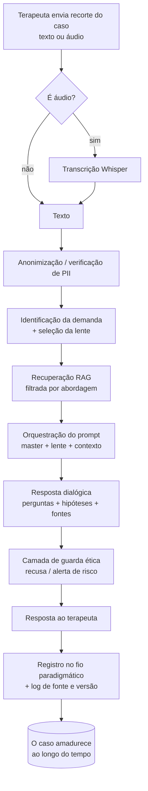

<!-- Coloque o arquivo do logo em ./assets/ideah-mark.svg (ou .png) para ele aparecer abaixo -->
<p align="center">
  
</p>

<h1 align="center">Paideia</h1>

<p align="center">
  <strong>Inteligência Dialógica</strong><br/>
  Um parceiro de raciocínio clínico que dialoga com a tradição teórica da sua abordagem.
</p>

<p align="center">
  
  
  
  
  
  
</p>

<p align="center">
  <a href="#o-que-é">O que é</a> ·
  <a href="#o-fio-paradigmático">O diferencial</a> ·
  <a href="#como-funciona">Como funciona</a> ·
  <a href="#arquitetura">Arquitetura</a> ·
  <a href="#começando">Começando</a> ·
  <a href="#ética-cfp--lgpd">Ética</a> ·
  <a href="#roadmap">Roadmap</a>
</p>

---

> **Se a inteligência artificial acelera respostas, a inteligência dialógica aprofunda perguntas.**

A clínica vive um paradoxo: nunca houve tanta informação e tão pouco espaço para elaborar. O cliente chega com o diagnóstico pronto da internet; a IA generativa entrega respostas instantâneas para qualquer pergunta. No meio disso, ficou estreito o lugar de **pensar o caso de verdade**.

A **Paideia** existe para proteger esse lugar — não para preenchê-lo com mais respostas prontas. Ela é um espaço onde o terapeuta dialoga com a tradição teórica da abordagem que escolheu: levanta hipóteses, recebe perguntas que abrem campo, consulta referências, e registra a evolução viva do caso. Sempre com o juízo clínico no comando do humano.

---

## O que é

A Paideia é uma **plataforma de apoio ao raciocínio clínico** para psicólogos e terapeutas. Não é um chatbot terapêutico, não é ferramenta de diagnóstico, não é supervisor humano.

| É | Não é |
|---|---|
| Um parceiro de raciocínio: espaço para pensar com a teoria que você escolheu | Ferramenta de diagnóstico ou rotulação |
| Um ambiente de estudo aplicado, ancorado em base teórica curada | Substituto da sua escuta, do seu juízo ou da supervisão humana |
| Um registro vivo do caso — hipóteses abertas e próximos focos | Chatbot para pacientes |

> A Paideia não confirma vontades: ela ancora na teoria e pode contrapor pedidos que contrariem a abordagem, convidando à reflexão ética.

---

## O fio paradigmático

O diferencial defensável da Paideia não é "ter IA". É a **profundidade teórica curada por abordagem** — e o conceito que nasce dela.

Ferramentas de documentação ligam etapas de processo: problema → objetivo → intervenção → progresso. Um fio operacional, que qualquer prontuário copia.

A Paideia propõe o **fio paradigmático**: o mesmo caso evoluindo dentro de uma ou mais lentes teóricas, em paralelo. O mesmo material clínico lido por Reich *e* por Jung, dois fios coexistindo. Isso só funciona com bases curadas e auditadas por abordagem — e é exatamente o trabalho que ninguém mais fez.

- **Defensável** porque exige curadoria, não código: replicar pede meses de trabalho teórico auditado.
- **Coerente** porque cada lente fala a partir de uma abordagem só, sem misturar paradigmas.
- **Vivo** porque o caso amadurece ao longo do tempo, não é um utilitário pontual.

---

## Funcionalidades

- **Diálogo por lente teórica** — perguntas que abrem campo, hipóteses abertas e referências citadas, na voz da abordagem escolhida.
- **Entrada por texto ou áudio** — o recorte do caso é transcrito e organizado (sempre pseudonimizado).
- **Fio do caso** — cada troca vira um nó vivo, e cada lente desenha o seu próprio fio.
- **Base consultada rastreável** — toda resposta registra a fonte, com status de direitos por obra.
- **Camada ética em tempo real** — recusa pedidos de diagnóstico fechado e dispara alerta diante de sinais de risco grave.
- **Coerência paradigmática garantida** — a recuperação de conhecimento é filtrada pela lente ativa.

---

## Como funciona



Os passos de anonimização, guarda ética e registro longitudinal são o que separa a Paideia de "um prompt bonito".

---

## As lentes teóricas

A Paideia estreia na abordagem mais rica e menos atendida por ferramentas de IA. As próximas lentes entram com a mesma curadoria, uma a uma — profundidade antes de quantidade.

| Lente | Status | Base de referência |
|---|---|---|
| Psicologia Corporal | **Disponível (beta)** | Reich, Lowen, Método dos 5 Elementos |
| Junguiana | Em desenvolvimento | Jung |
| Psicanálise | Planejada | Freud |
| Gestalt | Planejada | Perls, Polster |
| Psicodrama | Planejada | Moreno |
| TCC | Em avaliação | A. Beck, J. Beck |

---

## Arquitetura

Stack enxuto, poucas peças móveis, dados na própria infraestrutura.

| Camada | Tecnologia |
|---|---|
| Frontend + API | Next.js (App Router) na Vercel |
| Banco, Auth, Storage | Supabase (Postgres + RLS) |
| Vetores / RAG | `pgvector` no próprio Supabase |
| Transcrição áudio → texto | Whisper |
| Raciocínio (LLM) | Claude / GPT (definição por teste cego) |
| Embeddings | modelo de embeddings dedicado |

A **coerência paradigmática** é garantida no nível do banco: a recuperação de conhecimento filtra por `approach_id`, então um Oraculom corporal nunca puxa material de outra abordagem por acidente. Cada resposta grava fonte, versão do prompt e versão da base — rastreabilidade exigida pelo compliance e que vira diferencial de confiança.

---

## Estrutura do projeto

```text
paideia/
├─ app/                  # rotas e UI (Next.js App Router)
│  ├─ (workspace)/       # workspace do caso
│  └─ api/               # endpoints de diálogo, transcrição, ingestão
├─ lib/
│  ├─ rag/               # chunking, embeddings, recuperação por abordagem
│  ├─ prompts/           # prompt master + prompts por lente + guardrails
│  └─ supabase/          # client e tipos
├─ db/
│  ├─ migrations/        # schema (therapists, approaches, knowledge_chunks, cases…)
│  └─ seed/              # dados de exemplo
├─ content/              # base teórica curada (com status de direitos)
├─ public/
└─ README.md
```

---

## Começando

> Pré-requisitos: Node.js 20+, conta Supabase, chave de um provedor de LLM.

```bash
# 1. clonar
git clone https://github.com/<org>/paideia.git
cd paideia

# 2. instalar dependências
npm install

# 3. configurar variáveis de ambiente
cp .env.example .env.local
# preencha as chaves (abaixo)

# 4. aplicar o schema no Supabase
npm run db:migrate

# 5. popular dados de exemplo (opcional)
npm run db:seed

# 6. rodar em desenvolvimento
npm run dev
```

Variáveis de ambiente (`.env.local`):

```env
NEXT_PUBLIC_SUPABASE_URL=...
NEXT_PUBLIC_SUPABASE_ANON_KEY=...
SUPABASE_SERVICE_ROLE_KEY=...
LLM_PROVIDER=anthropic            # anthropic | openai
LLM_API_KEY=...
EMBEDDINGS_API_KEY=...
WHISPER_API_KEY=...
```

> O protótipo navegável (sem backend, só com dados de exemplo) está em `paideia-prototipo.html` — abra direto no navegador para sentir o fluxo.

---

## Ética, CFP & LGPD

A Paideia é construída em torno de uma fronteira clara, que é também seu cinto de segurança:

> **A Paideia não atende pacientes, não diagnostica, não prescreve condutas e não substitui supervisão clínica. Ela apoia o raciocínio profissional, organiza hipóteses e favorece a reflexão clínica fundamentada.**

Princípios operacionais:

- **Sem diagnóstico ou rótulo** — entrega perguntas, hipóteses abertas e recursos. A decisão é do profissional.
- **Decisão e supervisão humanas** — o juízo clínico é sempre do terapeuta; a Paideia apoia, não substitui.
- **Base curada e fechada** — respostas ancoradas na obra. Quando não há base, não inventa.
- **Rastreabilidade** — fonte consultada, versão do prompt e da base, recusas e alertas, tudo registrado.
- **Consentimento e LGPD** — dados de caso pseudonimizados; o profissional controla o que registrar, exportar e por quanto tempo.
- **Direitos autorais** — toda obra na base recebe um status (própria, domínio público, licenciada, autorizada, referência ou vedada). Nada entra sem classificação.

Alinhado às orientações do Conselho Federal de Psicologia sobre o uso de IA na prática psicológica (cartilhas de dezembro de 2025).

---

## Roadmap

- [x] Protótipo navegável do workspace (multi-lente, dados de exemplo)
- [x] Posicionamento, marca e landing
- [ ] Schema Supabase + RLS
- [ ] Pipeline de ingestão RAG (curadoria corporal)
- [ ] Diálogo real por lente (corporal) com guarda ética
- [ ] Fio paradigmático persistente
- [ ] Transcrição de áudio
- [ ] Beta fechado com terapeutas corporais
- [ ] Próximas lentes, uma a uma

---

## Time

| | Papel |
|---|---|
| **Eli Márcia** | Concepção clínica, curadoria teórica, voz das abordagens |
| **Jaya Roberta** | Tecnologia, governança, compliance e ponte clínico-técnica |
| **Carlos Magno** | Produto, arquitetura e entrega da plataforma |

---

## Contribuição

Projeto privado, em fase de fundação. O fluxo de trabalho, padrões de branch e processo de revisão estão definidos em `CONTRIBUTING.md` (a publicar). Decisões estratégicas — marca, sociedade, uso de dados reais, novas abordagens — passam por acordo entre as partes fundadoras.

---

## Licença

**Proprietária — todos os direitos reservados.** Este repositório e seus ativos (código, prompts, base de conhecimento curada, marca e documentação) não estão licenciados para uso, cópia ou distribuição sem autorização expressa por escrito das partes titulares. A marca *Shakti Jaya* e o *Método dos 5 Elementos* são de titularidade de Jaya Roberta e não integram a cessão deste projeto.

---

## Aviso legal

A Paideia é uma ferramenta de apoio ao raciocínio profissional. Não realiza diagnósticos, não substitui o julgamento clínico, a supervisão humana ou o atendimento de emergência. O uso pressupõe consentimento informado e respeito à LGPD. Este documento não constitui parecer jurídico; a estrutura societária e de proteção de dados deve ser validada por profissionais habilitados.

<p align="center">
  <sub>Paideia — Inteligência Dialógica · © 2026 · Todos os direitos reservados</sub>
</p>
